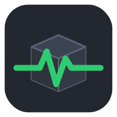
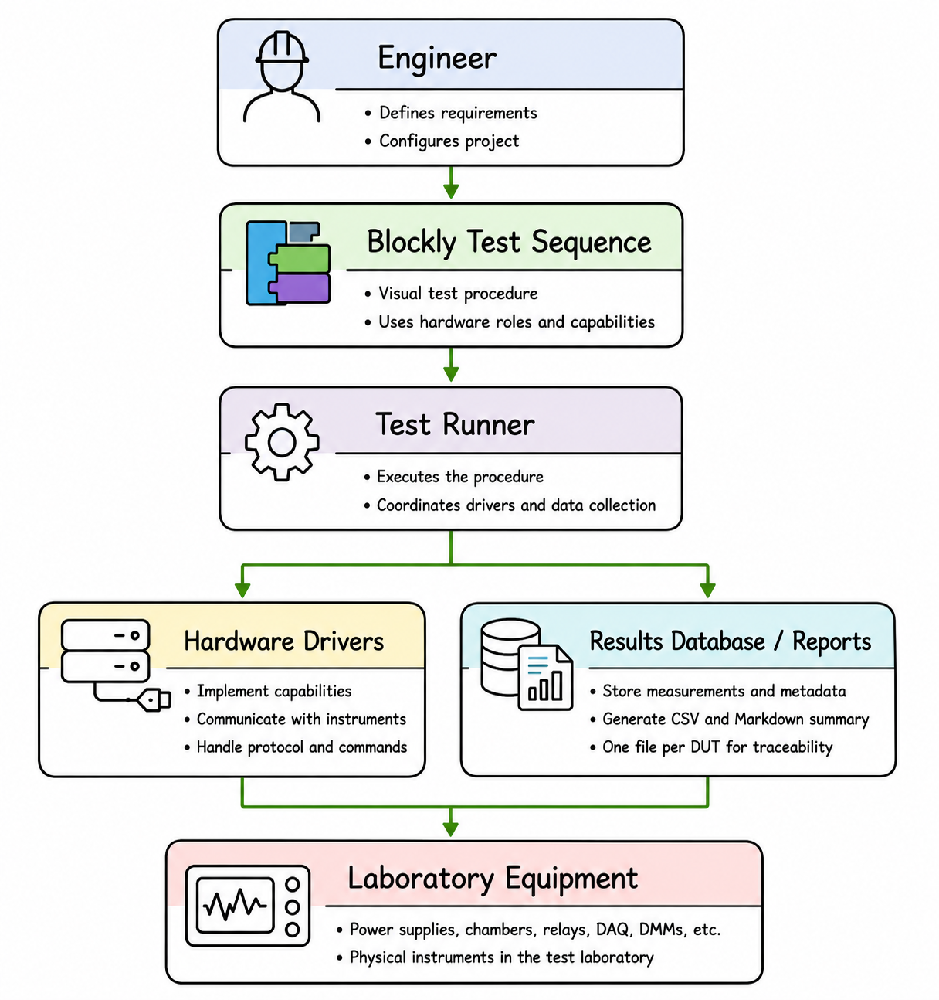

<p align="center">
	
</p>

<h1 align="center">Test in a Box</h1>

<p align="center">
A visual engineering test automation platform for electrical and environmental R&amp;D validation.
</p>

<p align="center">
  <a href="https://polyformproject.org/licenses/noncommercial/1.0.0">
    
  </a>
</p>

> **Development status:** Test in a Box is currently **v0.1.0-alpha**. Blockly-generated procedures have successfully controlled a physical Thurlby Thandar QL355P, and the native Windows Seeit USBB relay driver has been bench tested on physical hardware. Version 0.1 work remains, including Markdown summaries, progress estimation and a complete multi-instrument validation procedure.

## What is Test in a Box?

**Test in a Box** is an engineering test automation platform intended to make one-off and evolving electrical and environmental validation tests quicker to configure, automate and repeat.

It is aimed initially at research and development work involving **Devices Under Test (DUTs)** and **Equipment Under Test (EUTs)**.

Test in a Box separates the engineering test procedure from the details of the connected instruments. A test should request an action such as:

- set a voltage;
- change a chamber temperature;
- operate a relay;
- read a measurement;
- wait for a defined period;
- record a result.

The selected hardware driver is responsible for translating that request into the command or protocol required by the physical equipment.

Not every R&D test has a pass/fail criterion. Test in a Box is therefore intended to support both:

- informational and characterisation measurements; and
- measurements evaluated against defined acceptance criteria.

The initial focus is R&D electrical and environmental validation. More structured production and end-of-line testing may be explored later.

## Why was Test in a Box created?

Engineering test systems are frequently built as one-off solutions using a combination of:

- instrument-control scripts;
- spreadsheets;
- manual procedures;
- vendor software;
- custom drivers;
- project-specific logging tools.

These systems can work well for an individual test, but they can become difficult to maintain, adapt and reuse.

Test in a Box aims to provide a common framework for:

- creating repeatable automated test procedures;
- testing multiple DUTs using the same sequence;
- controlling different types of laboratory equipment;
- collecting engineering measurements;
- recording results against individual DUTs;
- reducing the amount of bespoke software required for each test programme;
- allowing test procedures to be changed without rewriting instrument-control
  code.

## Current capabilities

The repository currently includes:

- a locally hosted FastAPI web application;
- a Blockly test-procedure editor;
- hardware set and read blocks;
- wait and logging blocks;
- operator prompts;
- assertions and tolerance checks;
- Blockly loops, logic, maths and variables;
- run, pause, step, resume and stop controls;
- test-sequence save and load;
- GUI-based device configuration;
- live mimic-style instrument controls and readouts;
- DUT-to-position mapping;
- per-DUT CSV logging;
- run metadata containing hostname, logged-in user, OS version, Python version and instrument identity;
- instrument discovery for supported drivers;
- mock PSU and relay drivers for development without physical hardware.

Hardware drivers currently included in the repository cover:

- generic SCPI instruments;
- Aim-TTi programmable power supplies;
- Seeit USB-RELAY08 serial hardware;
- Seeit USBB native USB relay hardware on Windows;
- Pico TC-08 temperature loggers;
- Pico ADC-20/24 data loggers;
- mock instruments for development and demonstrations.

The Aim-TTi driver has been bench tested on a physical Thurlby Thandar QL355P. The Seeit USBB native USB driver has also switched physical relay hardware successfully on Windows. Multi-board selection is supported by vendor DLL enumeration index, but that index may change when USB topology changes. Other drivers may still be simulated or unverified; check the application's **Supported Devices** page before relying on them for a test.

## v0.1 direction

The agreed v0.1 scope also includes:

- test parameters defined in one place;
- explicit engineering units for parameters and measurements;
- logical hardware roles that can be mapped to available instruments;
- reusable hardware definitions;
- progress percentage and a progress bar;
- estimated finish time;
- current DUT and current test step;
- CSV result files;
- a Markdown run summary;
- defined safe shutdown behaviour;
- an end-to-end electrical or environmental validation test.

These are v0.1 goals and are not all implemented yet.

See [`docs/MVP-v0.1.md`](docs/MVP-v0.1.md) for the agreed scope boundary.

## Architecture

<p align="center">
  
</p>

The test procedure describes what should happen.

The driver layer determines how to communicate with the selected hardware.

The principal source layout is:

```text
tiab/
  drivers/
    base.py
    catalog.py
    registry.py
    mock.py
    aimtti_psu.py
    scpi_generic.py
    serial/
      seeit_relay.py
    usb/
      seeit_relay.py
    pico_tc08.py
    pico_adc.py
    scpi_command_map.example.json

  run/
    control.py
    csv_logger.py
    instrument.py
    mapping.py
    runner.py

  example_scripts/
    demo_test.py

webapp/
  server.py
  config.json

  static/
    index.html
    app.js
    custom_blocks.js
    generators.js
    devices.html
    devices.js
    supported-devices.html
```

## Examples

Bench-tested and planned engineering examples are available in the [examples directory](examples/README.md).

## Documentation

The documentation index is available at:

[`docs/README.md`](docs/README.md)

Recommended starting points:

- [Vision](docs/VISION.md)
- [MVP v0.1](docs/MVP-v0.1.md)
- [Architecture](docs/ARCHITECTURE.md)
- [Engineering philosophy](docs/ENGINEERING-PHILOSOPHY.md)
- [User workflow](docs/USER-WORKFLOW.md)
- [Instrument Library](docs/INSTRUMENT-LIBRARY.md)
- [Engineering Results](docs/ENGINEERING-RESULTS.md)
- [Hello World examples](docs/HELLO-WORLD.md)

The project website contains further background, motivation and development updates:

https://philipmcgaw.com/projects/test-in-a-box/


## Platform support

The core web application, Blockly editor, mock drivers and many serial or network instruments are intended to run on Windows, Linux and macOS.

Driver support depends on the vendor transport:

| Capability | Windows | Linux | macOS |
|---|:---:|:---:|:---:|
| Web application and Blockly | Yes | Yes | Yes |
| Mock instruments | Yes | Yes | Yes |
| Generic SCPI through PyVISA/PyVISA-py | Yes | Yes | Yes |
| Aim-TTi serial driver | Yes | Expected | Expected |
| Seeit USB-RELAY08 serial driver | Yes | Expected | Expected |
| Seeit USBB native USB DLL driver | Yes | No | No |
| Pico drivers | SDK-dependent | SDK-dependent | SDK-dependent |

The Seeit USBB native USB driver depends on the vendor's Windows DLL and is therefore Windows-only. The DLL is not currently distributed with Test in a Box while redistribution permission is being confirmed.

See [Platform support](docs/PLATFORM-SUPPORT.md) for current limitations.

## Running on Windows without administrator rights

Test in a Box is designed to run in restricted engineering environments where users may not have permission to install software system-wide.

See:

[`docs/getting-started/WINDOWS.md`](docs/getting-started/WINDOWS.md)

for the complete setup process.

On Windows, prepare the portable runtime and dependencies by running:

```text
bootstrap.bat
```

The bootstrap downloads WinPython automatically when the project `python`
folder is missing, installs dependencies, creates required folders and verifies
the environment. No administrator rights are required.

After bootstrap completes, start the application using:

```text
2_start_app.bat
```

The application is served locally at:

```text
http://127.0.0.1:8765
```

No system-wide application installation is required.

## Running the no-hardware demonstration

The command-line demonstration uses mock instruments and does not require any laboratory hardware.

Install the Python dependencies:

```bash
pip install -r requirements.txt
```

Run the demonstration from the repository root:

```bash
python -m tiab.example_scripts.demo_test
```

The demonstration performs a simulated multi-DUT test and writes separate CSV files for the configured DUTs.

Example output:

```text
runs/demo_run_001/
  run_demo_run_001_DUT_DUT-0001.csv
  run_demo_run_001_DUT_DUT-0002.csv
  run_demo_run_001_DUT_unassigned.csv
  run_demo_run_001_metadata.csv
```

The current event schema is:

```text
timestamp,device_id,position,channel,value,unit,event_type
```

An event may represent:

- a measurement;
- a commanded state;
- a log entry;
- a test assertion.

## Adding hardware

### Generic SCPI instruments

Many SCPI instruments can be added using a command-map file rather than a new Python driver.

Start with:

```text
tiab/drivers/scpi_command_map.example.json
```

The command map describes the instrument resource, available positions and the commands used to access them.

A device can then be added using the generic SCPI driver and the path to its command-map file.

### Custom hardware drivers

For non-SCPI hardware:

1. Create a driver module under:

   ```text
   tiab/drivers/
   ```

2. Subclass the base `Driver`.

3. Implement the operations appropriate to the device, such as:

   - `connect()`
   - `close()`
   - `capabilities()`
   - `write()`
   - `read()`
   - `query()`

4. Register the driver:

   ```python
   @register_driver("your_type_name")
   ```

5. Add a mock implementation for any capability used by examples or automated
   tests.

## Project naming

Test in a Box uses engineering-oriented project terminology.

A typical test may be identified using separate fields such as:

```text
Project:    TO-1800
DUT:        C
Test case:  TC2
Test name:  Pickup and Hold Voltage
```

A combined display name may therefore be:

```text
TO-1800.C — TC2 Pickup and Hold Voltage
```

## Roadmap

The immediate priority is completing the v0.1 workflow:

1. configure the available hardware;
2. create a test procedure in Blockly;
3. run the procedure;
4. monitor progress;
5. record results against the correct DUT;
6. generate CSV data and a Markdown summary.

Later development may include:

- richer pass, warning and fail evaluation;
- improved graphs and reports;
- result databases;
- calibration information;
- test-sequence versioning;
- improved recovery after interruptions;
- operator workflows;
- barcode support;
- multi-rig monitoring;
- production and end-of-line testing features.

See [`docs/ROADMAP.md`](docs/ROADMAP.md) and
[`docs/FUTURE-IDEAS.md`](docs/FUTURE-IDEAS.md) for more detail.

## Author

**Philip McGaw MIET**

Lead EMC Test Engineer specialising in:

- automotive battery testing;
- electrical and environmental validation;
- SCPI automation;
- laboratory test systems;
- embedded electronics.

### Contact

- Website: https://philipmcgaw.com
- GitHub: https://github.com/PhilipMcGaw
- LinkedIn: https://www.linkedin.com/in/philipmcgaw/
- Email: [philip@mcgaw.eu](mailto:philip@mcgaw.eu)

Development is being kept under the author's control until version 1.

Bug reports and practical feedback are welcome.

## Commercial licensing

Test in a Box is available for non-commercial use under the
**PolyForm Noncommercial License 1.0.0**.

Commercial use requires separate permission from the copyright holder.

For commercial licensing enquiries, contact:

[philip@mcgaw.eu](mailto:philip@mcgaw.eu)

## License

This project is licensed under the:

**PolyForm Noncommercial License 1.0.0**

See the [`LICENSE`](LICENSE) file for the complete licence text.

Official licence page:

https://polyformproject.org/licenses/noncommercial/1.0.0

## Installation, updates and releases

- [Windows setup](docs/getting-started/WINDOWS.md)
- [macOS, Linux and Raspberry Pi setup](docs/getting-started/MAC-LINUX-RASPBERRY-PI.md)
- [Windows bootstrap](bootstrap/README.md)
- [Updater V2](updater/README.md)
- [Repository Refactor v1](docs/project/REPOSITORY-REFACTOR-v1.md)
- [Release checklist](docs/release/RELEASE-CHECKLIST.md)
- [Changelog](CHANGELOG.md)
