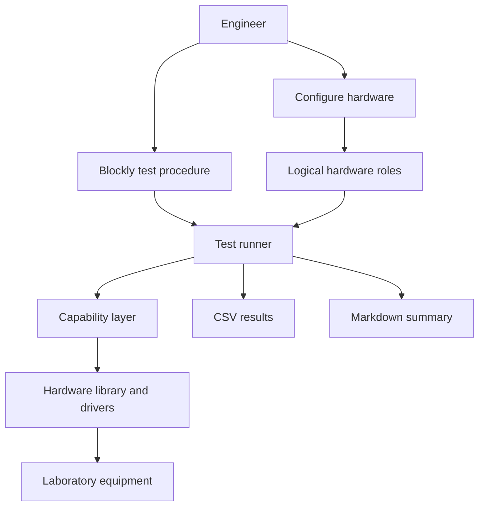

# Architecture

Test in a Box separates the test procedure from the physical hardware used to
perform it.

## User-interface areas

- **Configure** — add instruments, set connection details and verify them.
- **Author** — build the test procedure and parameters in Blockly.
- **Execute** — run the test and show progress, estimated finish and current DUT.
- **Diagnostics** — manual control, communication logs and the mimic panel.

## Test procedure

A saved procedure contains logical hardware roles, parameters and units,
sequence and loop structure, measurements, logging and optional assertions. It
does not contain fixed COM ports.

## Capability layer

Blockly asks for capabilities such as set voltage, read current, enable output,
set temperature or read digital state. A selected driver must provide the
required capabilities.

## Hardware library

A new instrument is described and saved once. Later projects select that
definition and configure only the current connection.

## Test runner and results

The runner executes the procedure, maintains run state, logs events and performs
safe shutdown. Each run produces CSV data and a Markdown summary, with instrument
identity captured at the beginning.
