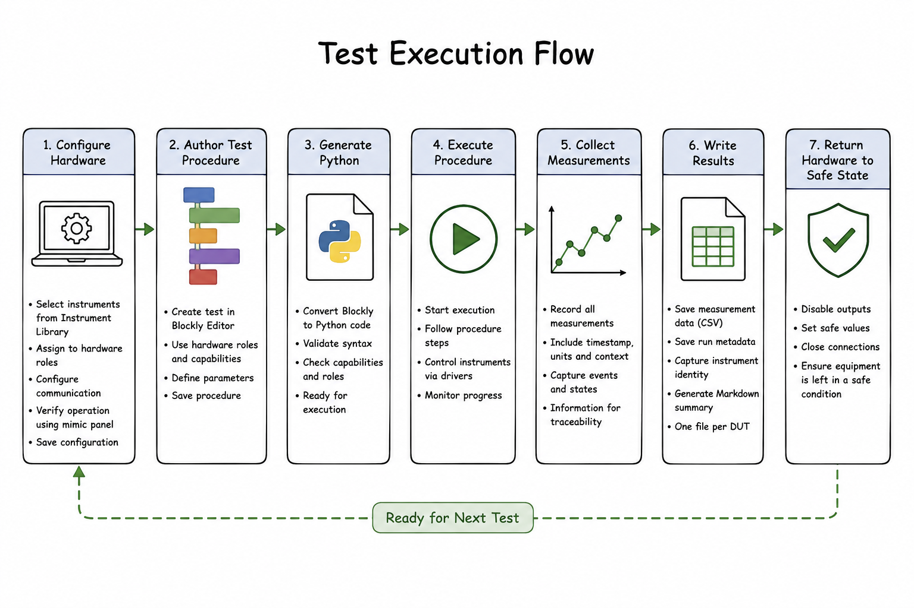

# Architecture

## Overview

Test in a Box separates **engineering test procedures** from the details of the
hardware used to perform them.

An engineer creates a test procedure that describes **what** should happen.

The framework determines **how** that procedure is carried out using the
available laboratory equipment.

This separation allows the same test procedure to be reused with different
instruments by changing hardware configuration rather than rewriting the test.

---

# High-Level Architecture

<p align="center">
  
</p>

---

# Current Implementation

The current repository consists of two principal components.

## tiab/

The Python backend.

Responsibilities include:

- Hardware drivers.
- Driver registration.
- Test execution.
- DUT mapping.
- CSV logging.
- Instrument abstraction.

Current structure:

```text
tiab/
    drivers/
    run/
    example_scripts/
```

---

## webapp/

The browser-based user interface.

Responsibilities include:

- Blockly editor.
- Device configuration.
- Live mimic controls.
- Test execution.
- Sequence save/load.
- Web API.

Current structure:

```text
webapp/
    server.py

    static/
        index.html
        devices.html
        app.js
        devices.js
        custom_blocks.js
        generators.js
```

---

# Driver Architecture

Every supported instrument is represented by a driver.

Drivers expose capabilities to the rest of the framework rather than requiring
the Blockly layer to understand individual communication protocols.

Examples include:

- Generic SCPI instruments.
- Aim-TTi power supplies.
- Relay controllers.
- Pico data acquisition devices.
- Mock hardware.

Where practical, each driver should have a corresponding mock implementation to
allow development without physical equipment.

---

# Hardware Configuration

Test procedures should not contain:

- COM port numbers.
- VISA resource strings.
- USB addresses.
- Manufacturer-specific commands.

Instead they should reference logical hardware roles.

Examples:

- Power Supply
- Environmental Chamber
- Relay Controller
- Data Acquisition
- Temperature Logger

The physical instrument fulfilling that role is selected when configuring the
test system.

---

# Test Execution

A typical execution flow is:

<p align="center">
  
</p>

---

# Results

The current implementation records CSV data and generates a machine-readable
run manifest plus a Markdown summary. The reports describe:

- Project.
- DUT.
- Test case.
- Instrument identity.
- Duration.
- Result files.

Run reports also include hashes for the configuration, DUT mapping and
generated procedure, together with software and captured instrument identity
where available. Completion of the full v0.1 reporting workflow remains a
validation/release task, but the basic report mechanism is implemented.

---

# Design Principles

The architecture is based on the following principles.

## Engineering intent

Test procedures describe engineering actions rather than communication
protocols.

---

## Hardware abstraction

Drivers implement hardware communication.

Blockly should never need to know SCPI commands or serial protocols.

---

## Reusable hardware

Hardware definitions should be reusable between projects.

The procedure should remain unchanged when an instrument is replaced.

---

## Explicit engineering units

Parameters and measurements should always include engineering units.

Examples:

- 40 °C
- 9 V
- 3600 s
- 0.2 V/s
- 0.373 mΩ

---

## Mock-first development

Where practical, new capabilities should include mock implementations.

This allows development and testing without requiring laboratory equipment.

---

# Future Architecture

The current architecture has been designed so that future features can be added
without fundamentally changing the framework.

Potential future additions include:

- Richer reporting.
- Result databases.
- Calibration management.
- Production workflows.
- Multiple concurrent test systems.
- Notification services.

These are intentionally outside the scope of Version 0.1.
