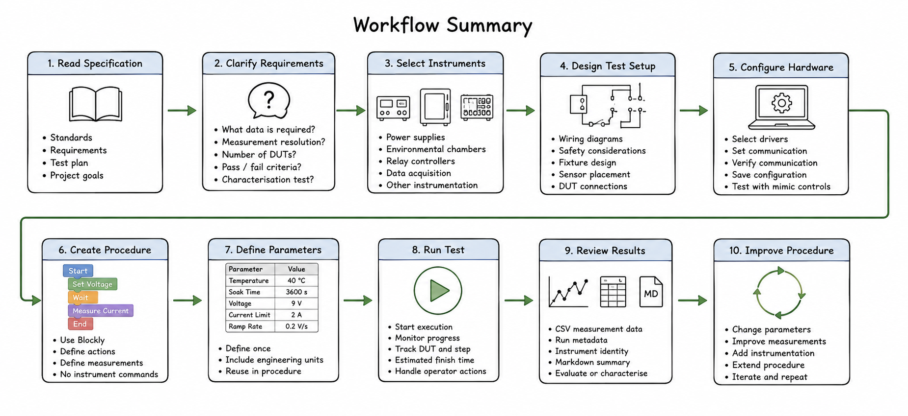

# User Workflow

## Introduction

Test in a Box is designed to fit into a normal engineering validation workflow.

The software does not replace the engineering process.

Instead, it automates the repetitive work involved in executing and recording a
well-designed test procedure.

The typical workflow is shown below.

---

# 1. Understand the Requirement

Every test begins with a specification.

This may be:

- an international standard;
- an internal engineering specification;
- a customer requirement;
- a project-specific test plan.

The first task is understanding **what the project team wants to learn**.

Where requirements are unclear, additional questions should be asked before
building the test.

Examples include:

- What data is required?
- What measurement resolution is required?
- How many DUTs are involved?
- Are there pass/fail criteria?
- Is this a characterisation test?

The quality of the automated test depends on the quality of the engineering
requirement.

---

# 2. Select Suitable Equipment

Once the requirements are understood, suitable laboratory equipment can be
selected.

Typical equipment includes:

- Programmable power supplies.
- Environmental chambers.
- Relay controllers.
- Data acquisition hardware.
- Oscilloscopes.
- Digital multimeters.

The choice of instrument should satisfy the engineering requirements rather
than the software.

---

# 3. Design the Physical Test Setup

The physical wiring and laboratory setup are designed using the normal
engineering process.

This typically includes:

- Wiring diagrams.
- Safety considerations.
- Fixture design.
- Sensor placement.
- DUT connections.

This stage remains outside the scope of Test in a Box.

---

# 4. Configure the Instruments

Once the laboratory equipment has been connected, configure it using the
**Configure Devices** page.

For each instrument:

- Select the driver.
- Enter communication settings.
- Verify communication.
- Save the instrument definition.
- Confirm operation using the mimic controls.

Where available, drivers may use identity queries such as `*IDN?` to verify
communication. Instrument identity is recorded in run metadata and provenance
reports when the driver exposes it.

---

# 5. Create the Test Procedure

The engineering procedure is represented using Blockly.

The procedure should describe:

- what actions should occur;
- what measurements should be taken;
- what information should be recorded.

It should not describe:

- SCPI commands;
- serial protocols;
- COM ports;
- USB addresses.

Those details belong to the hardware drivers.

---

# 6. Define Test Parameters

Values likely to change should be defined once.

Typical parameters include:

- Chamber temperature.
- Soak time.
- Supply voltage.
- Current limit.
- Ramp rate.
- Number of DUTs.

Parameters should always include engineering units.

For example:

```text
40 °C
3600 s
9 V
0.2 V/s
```

The Blockly procedure should reference these parameters rather than repeating
literal values.

---

# 7. Execute the Test

Once the procedure has been completed:

- Start the test.
- Monitor the execution console and current run state.
- Use Pause, Resume, Step and Stop where required.

The complete progress display, current-DUT/current-step presentation and
estimated finish time remain Version 0.1 work.

Where operator interaction is required, Test in a Box pauses the procedure and
requests the required input.

---

# 8. Review the Results

The current alpha records:

- CSV measurement and event data;
- separate result files per mapped DUT where practical.
- run metadata containing host and instrument identity where available;
- a machine-readable run manifest;
- a human-readable Markdown summary.

Version 0.1 still requires validation and acceptance of:

- the complete reporting workflow;
- the remaining progress and execution-status experience;
- a complete real multi-instrument engineering validation procedure.

Some tests simply record engineering information.

Others compare measurements against defined acceptance criteria.

Both workflows are considered valid.

---

# 9. Refine the Procedure

Engineering validation is an iterative process.

After reviewing the results the engineer may decide to:

- change test parameters;
- improve measurements;
- add additional instrumentation;
- extend the procedure.

Blockly allows these changes to be made without rewriting instrument-control
software.

---

# Workflow Summary

The normal engineering workflow supported by Test in a Box is illustrated below.

<p align="center">
  
</p>

The important point is that Test in a Box does **not** replace the engineering
process.

The engineer still:

- understands the specification;
- selects appropriate instrumentation;
- designs the physical test setup;
- decides what measurements are required.

Test in a Box automates the execution of that engineering procedure and the
collection of repeatable results.

---

# Guiding Principle

Test in a Box is intended to automate the execution of good engineering.

It is not intended to replace the engineering process that creates the test
procedure in the first place.
